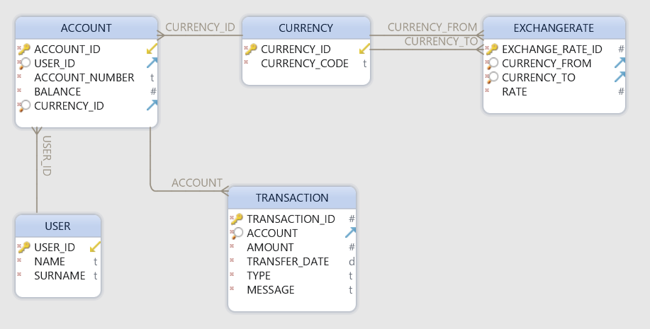

# Money Transfer Backend Test
Design and implement a RESTful API (including data model and the backing implementation) for
money transfers between accounts.

#### Explicit requirements
1. You can use Java or Kotlin.
2. Keep it simple and to the point (e.g. no need to implement any authentication).
3. Assume the API is invoked by multiple systems and services on behalf of end users.
4. You can use frameworks/libraries if you like (except Spring), but don't forget about
requirement #2 and keep it simple and avoid heavy frameworks.
5. The datastore should run in-memory for the sake of this test.
6. The final result should be executable as a standalone program (should not require a
pre-installed container/server).
7. Demonstrate with tests that the API works as expected.

#### Implicit requirements:
1. The code produced by you is expected to be of high quality.
2. There are no detailed requirements, use common sense.

#### Technology stack
1. ##### Implementation
   * Dropwizard
   * H2 Database Engine - as we need to maintain consistency of data, H2 - 
     perfect choice for in-memory storage.  
   * MyBatis - first class persistence framework with support for custom SQL,
     stored procedures and advanced mappings. From my point of view it is very
     good alternative to plain JDBC.  
   * Liquibase - database migration tool.
2. ##### Testing
   * JUnit5, Mockito for unit testing.
   * Spock for integration testing.
   * Swagger for manual testing and documentation.
3. ##### Build system
   * Gradle

#### User API

| Endpoint                     | Method| Description   
| -----------------------------|-----|-------------
| /v1/user/{userId}            |GET  | Get user info
| /v1/user/{userId}/account    |POST | Create new account for user      
| /v1​/user​/{userId}​/accounts   |GET  | Get user accounts     

#### Account API

| Endpoint                               | Method| Description   
| ---------------------------------------|-------|-------------
| /v1/account/{accountId}                |GET    | Get account info
| /v1/account/{accountId}                |DELETE | Delete account with all transactions     
| /v1/account/{accountId}/transactions   |GET    | Get account transactions

#### Fund transfer API

| Endpoint                     | Method| Description   
| -----------------------------|-------|-------------
| /v1/transfer                 |POST   | Fund transfer between two accounts

#### Database schema


#### Run application

To run application please execute command

```
gradle run
``` 

#### Test classes
1. \src\test\groovy - integration tests
2. \src\test\java - unit tests

#### Live example

```
http://revolut-backend-test.eu-west-1.elasticbeanstalk.com/swagger
```